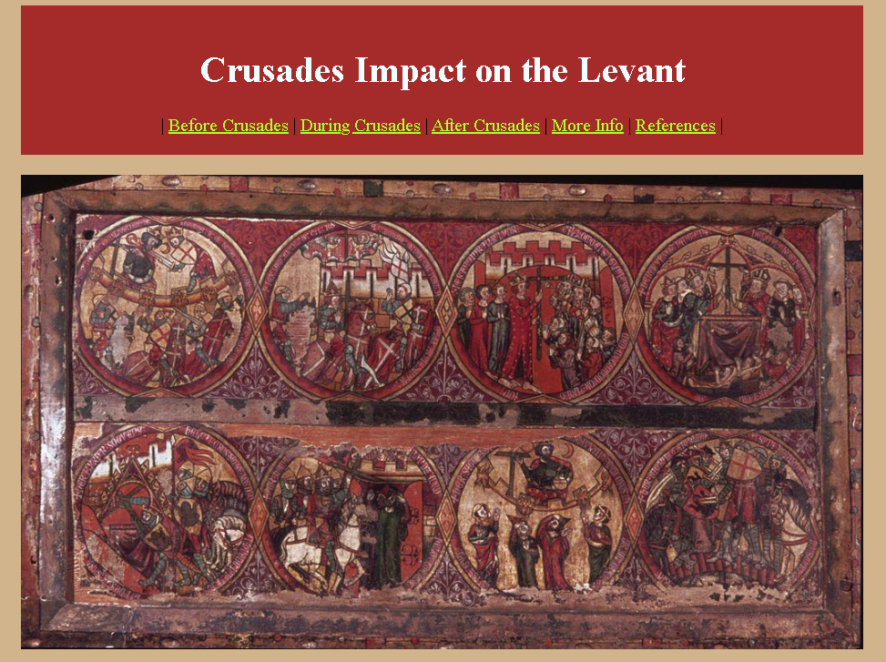

# Crusades Impact of the Levant (source)



## Overview

This is my class project for HIST 3953 "The Modern Middle East" from the University of Oklahoma...

## Creation

By design, there are no buttons or javascript in the website. Only Static HTML/CSS...

This project was alot of fun. It introduced me to new ways of thinking, and research straight from the source of information...

## Project Structure

```
|- images/*        # Images for the website.
|- pages/*         # Pages for the websiste
|- public/*        # Favicons and other resources.
|
|- .gitignore      # Used to ignore local files.
|- global.css      # Stylesheet for the website.
|- index.html      # The Homepage of website.
|- requirements    # The project requirements.
```
